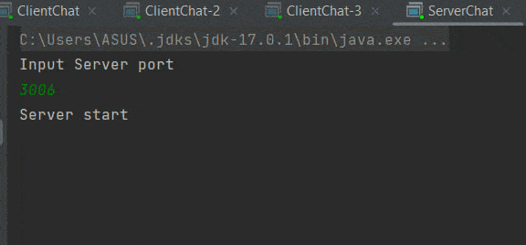
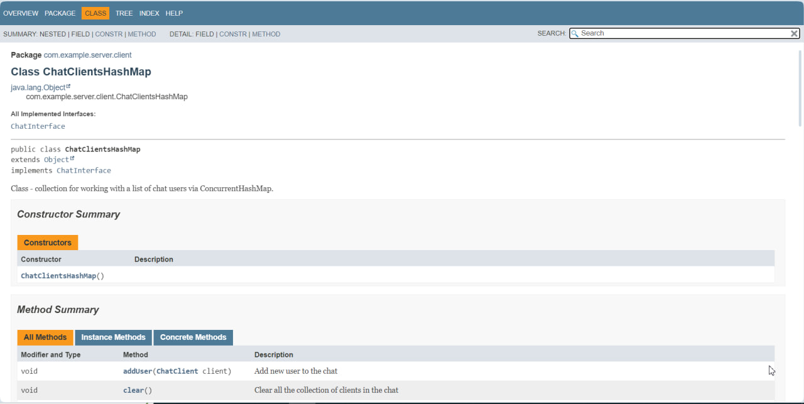
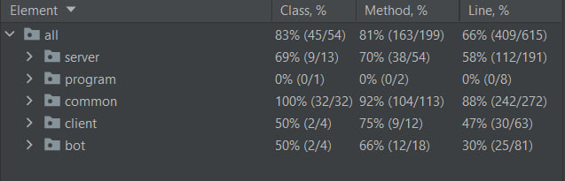

### Multi-user chat built on multi-threaded code

This project is a multi-user chat application that allows users to connect to a server, send messages to each other, and execute commands. The chat is built on multi-threaded code, using TCP sockets for communication between clients and the server.

## Features

- Users can enter their name upon entry. If the name is already taken, the user can enter another name.
- Users can send messages to all other connected clients.
- Previous messages are stored on the server during the current session, with the last 100 messages being sent to new clients upon connection.
- The server supports up to 1000 simultaneous clients.
- Users can send arbitrary commands to the server and receive the execution result in response. New commands can be easily added, and there is a help command that returns information on other commands.
- The chat application is covered with unit tests and has been load tested with various numbers of clients.




## Commands

Here are some commands that you can use in the chat application:

- **helpCommand**: Display information on available commands. Type 'HELP' in console.
- **countUserCommand**: Get the number of connected clients. Type 'COUNT_USERS' in console.
- **loginCommand**: Log in users in chat. Type 'LOGIN' in console.

## Getting Started

To get started with the chat application, follow these steps:

1. Clone the repository:

```git clone https://github.com/MilaEgoshina/ChatServer```

2. Compile and run the server:

```
cd src/main/java/server
javac Main.java
java Main
```

3. Compile and run the client:

```
cd src/main/java/client
javac Main.java
java Main
```

4. Connect multiple clients to the server and start chatting!

## Deployment

You can download and use [runConfigurations](https://github.com/MilaEgoshina/ChatServer/tree/main/runConfigurations) package. In this package there is a ChatDemo.xml file which automatically run application with all configurations.

## Dependencies

This program depends on Java version 11 or higher. If you notice that this software can be run on a lower version, or it does not work on any version, then write to milavoronina0108@gmail.com.

## Documentation

Please, if you want to see the full documentation on English for this project, download **docs/eng** package and open [index.html](https://github.com/MilaEgoshina/ChatServer/blob/main/docs/eng/index.html) file. Or you can observe the full documentation on Russian using [this link](https://github.com/MilaEgoshina/ChatServer/blob/main/docs/ru/index.md).



## Running the tests

The chat application is covered with unit tests to ensure its functionality is working as expected. You can run the unit tests using the following command:

```
cd src/test/java
mvn test
```
### Code Coverage: 66%



## Contributing

If you would like to contribute to the project, feel free to submit a pull request with your changes. Please ensure that your code follows the project's coding standards and is well-tested.